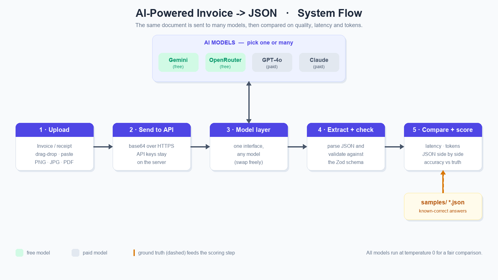

# Project Proposal (Extended): AI-Powered Invoice-to-JSON Web App

## Summary

This project is a web application that uses AI to automatically read invoices
and shop receipts and turn them into **structured data**. A user uploads a
document (image or PDF), an AI vision model extracts the relevant fields, and the
app returns a clean, validated **JSON object** representing the invoice.

Crucially, the app is also a **comparison framework**: it can run the *same*
document through *different* AI models and show their results side by side —
measured on **output quality, response time, and token usage** — so models can be
evaluated objectively on one concrete, measurable task.

## Motivation

Manually entering invoice data is slow and error-prone, and it is a common
real-world business problem. Modern AI models can read documents directly, but
they differ widely in accuracy, speed, and cost. This project is therefore both:

- a **practical tool** — a working invoice extractor, and
- an **experiment** — a small, reusable framework for objectively comparing AI
  models on a real task with a measurable ground truth.

## What this project achieves

1. **A working document-understanding tool.** Any invoice or shop receipt (photo,
   scan, or PDF) is converted into a consistent JSON structure in seconds,
   without manual typing.

2. **A provider-independent abstraction over AI models.** All models sit behind
   one small interface, so the rest of the app does not know or care which model
   ran. Adding a new model is a one-line change. This is the architectural heart
   of the project.

3. **An objective model-comparison framework.** The same document can be sent to
   several models at once; the app captures and displays **latency**, **token
   usage**, and the **JSON output** of each, side by side.

4. **A measurable quality benchmark.** A set of sample documents with
   known-correct ("ground truth") JSON lets the app score any model's output
   **field by field** (accuracy % + a colour-coded diff). This turns "which model
   is better?" from an opinion into a number.

5. **A privacy-respecting design.** API keys live only on the server; the browser
   never sees them. Documents are processed on demand and not stored.

6. **A seed dataset for future training.** The image + ground-truth-JSON pairs are,
   by design, the beginning of a labelled training set — so fine-tuning a
   dedicated model later is a natural next step, not a redesign.

7. **A reproducible, demoable result.** The whole thing runs locally with a single
   command and a free API key, making it easy to present and defend.

## Core features (MVP)

- **Invoice upload.** A drag-and-drop zone with click-to-browse and
  clipboard-paste (`Ctrl+V`) fallbacks. Accepts PNG, JPG/JPEG, WebP and PDF,
  multiple files at once, with a thumbnail preview of each.
- **AI extraction to JSON.** The document is sent to an AI model, which returns a
  structured object with vendor, invoice number, dates, line items, subtotal,
  **multiple tax rates**, total, and currency. The output is **validated against a
  schema** before it is shown.
- **Model switching & comparison.** A multi-select control chooses which models
  run. Each model's JSON, **latency**, and **token usage** are displayed side by
  side for direct comparison.

## How the comparison / evaluation works

- Every model receives the **same image and the same prompt**, at temperature 0,
  so differences come from the model, not from randomness.
- **Quality:** the predicted JSON is flattened into leaf fields (including each
  line-item and tax-line cell) and compared to the ground truth. Numbers match
  within a small tolerance; strings are compared case/space-insensitively.
  `accuracy = matching fields / total fields`.
- **Speed:** wall-clock latency of each model call is measured.
- **Cost proxy:** prompt/completion token counts are reported per run.

### Example result (current build)

| Document | Model | Accuracy | Latency | Tokens |
|---|---|---|---|---|
| ACME invoice (2 VAT rates) | Gemini 3 Flash | 100% (33/33) | ~3 s | ~1 970 |
| Spar receipt (real photo) | Gemini 3 Flash | 96% (24/25) | ~9 s | ~1 850 |

(The single "miss" on the receipt is the vendor name — brand vs. franchisee — a
genuine labelling ambiguity, which nicely demonstrates the diff view.)

## Architecture (overview)

A single Next.js app. The browser talks to two API routes; the API routes talk to
the model providers. Keys never leave the server. See the flow diagram below.

```
Browser (UI)
  └─ upload → encode → choose models → "Extract"
        │
        ▼  POST /api/extract  (base64 image, model id)
Server (Next.js)
  ├─ Model abstraction layer ── adapter ──► AI model (Gemini / GPT / Claude / OpenRouter)
  └─ parse + validate JSON (Zod schema)
        │
        ▼  ExtractionResult { json, latencyMs, tokens, error }
Results
  ├─ side-by-side comparison (JSON · latency · tokens)
  └─ scoring vs ground truth (samples/) → accuracy % + diff
```

### Flow diagram



## Future work: a trainable model

The architecture deliberately keeps the schema, the prompt, the model adapters,
and the data **decoupled**. The `samples/` folder of image + ground-truth pairs is
already a labelled dataset. A future step can therefore fine-tune a dedicated
invoice-extraction model by reading `samples/` directly — a natural extension
rather than a rewrite.

## Tech stack

Next.js 16 (App Router) · React 19 · TypeScript · Tailwind CSS 4 · Zod for schema
validation · `@google/genai` for Gemini, other providers via plain `fetch`. Runs
locally; one free API key is enough to demo it.
